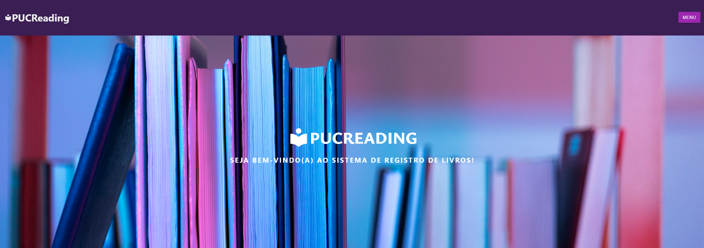
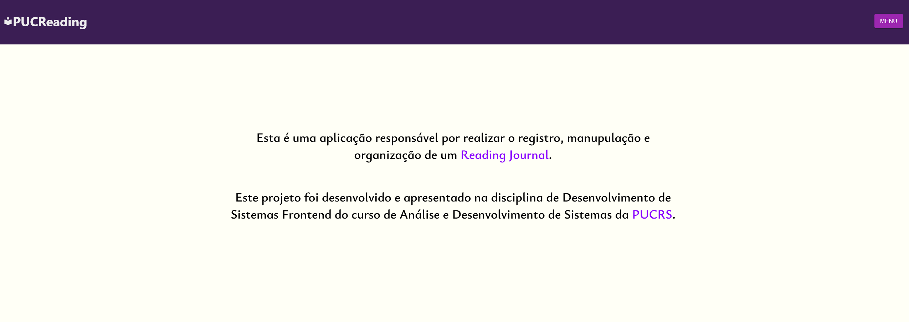
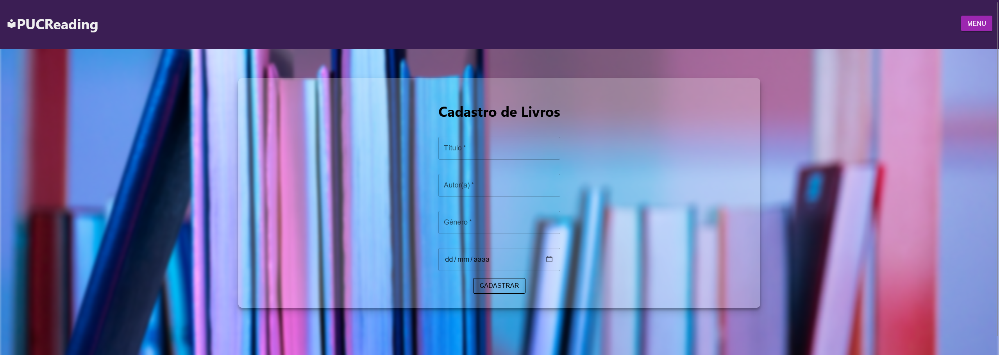
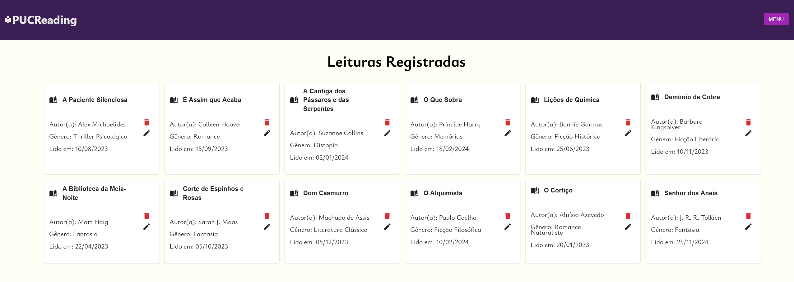
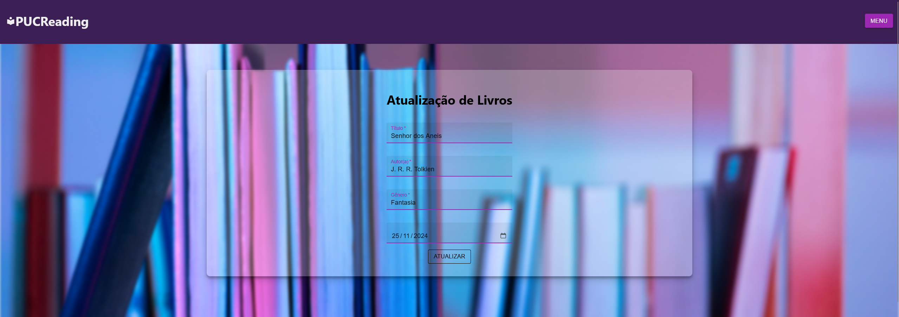

# Nome: Lucas Borges da Silva

# Projeto Reading Journal PUCRS

## Como executar?

Extraia o arquivo .zip, em seguida, acesse a pasta com o comando:

```bash

cd projeto-etapa-02-pucrs
```

execute o seguinte comando para instalar as dependências:

```bash
npm install
```

Após isso, execute o seguinte comando para que possa acessar o projeto em seu navegador web:

```bash
npm start
```

Aguarde o terminal informar a conclusão do carregamento e acesse `localhost:3000` em seu navegador para visualizar o projeto.


### Imagens do Projeto

> Tela inicial
 

> Sobre
 

> Adicionar Livro
 

> Lista de Livros
 

> Atualizar Livro
 

## Introdução

Este projeto, chamado "Reading Journal PUCRS", foi desenvolvido para demonstrar uma aplicação de registro e exibição de livros. Ele utiliza uma estrutura simples com armazenamento em LocalStorage para registrar e exibir livros, funcionando de forma dinâmica.

## Componentes

- **_BookForm_**
  - Componente responsável por renderizar o formulário de registro de novos livros na aplicação

- **_BookEdit_**

  - Componente responsável por renderizar o formulário de edição de livros já registrados

- **_BookList_**
  - Componente o qual realiza a exebição dos livros armazenados em memória, funciona dinamicamente atráves de requisições na API.

- **_ConfirmModal_**
  - Componente responsável por renderizar um modal de confirmação, o qual é utilizado para confirmar uma escolha do usuário e ramificar a ação.
  - *Atributos*
    - `title` - Título do modal
    - `description` - Mensagem do modal
    - `onClickYes` - Função a ser executada ao clicar no botão de confirmação
    - `onClickNo` - Função a ser executada ao clicar no botão de cancelamento
    - `handleClose` - Função a ser executada ao fechar o modal
    - `open` - Estado do modal, aberto ou fechado

- **_NavBar_**
  - Barra de navegação localizada no cabeçalho, barra a qual possui as rotas para todas outras páginas da aplicação e está sempre visível no topo de todas.
  

## Decisões do Projeto

 - Decidi por condensar todas rotas da navbar em um item de menu, o qual ao ser clicado, abre um menu dropdown com todas as opções de navegação. Tornando assim a navegação mais limpa e organizada para usuários em diferentes dispositivos.
